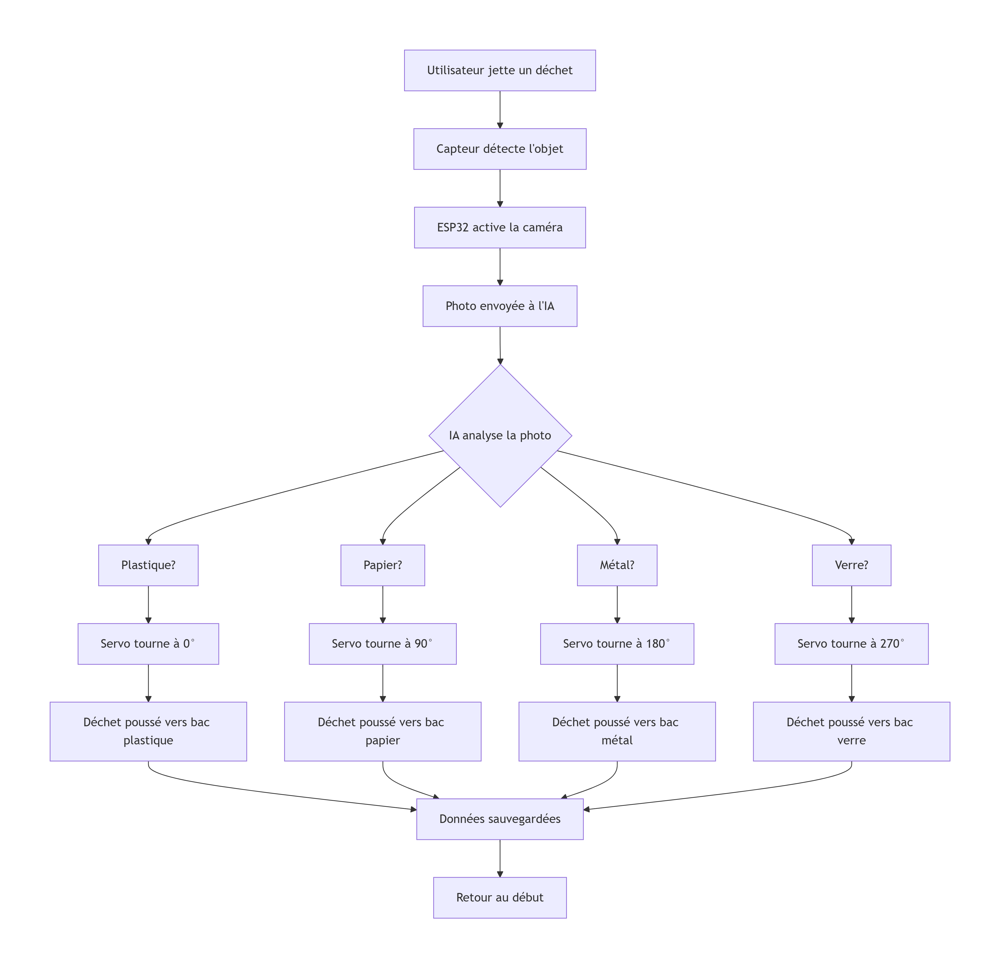
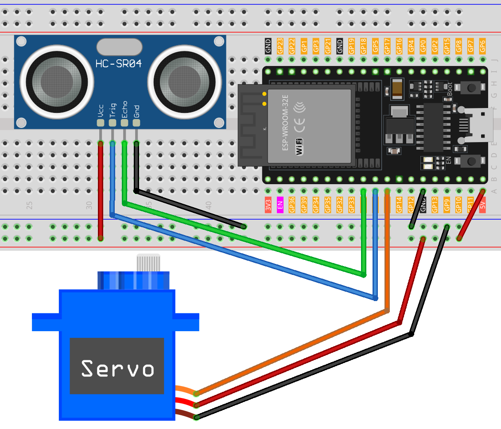
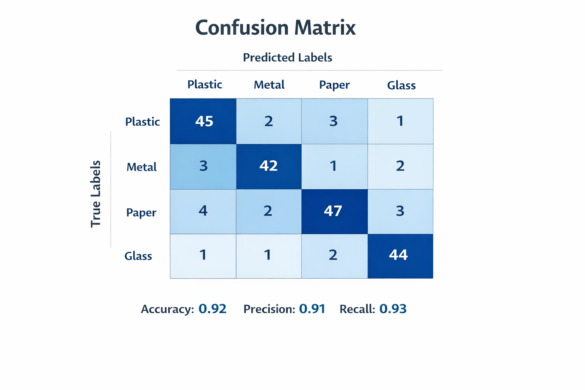

# TrashAI — Automatic Waste Sorting System 🗑️🤖

> MobileNetV2 running on ESP32 — classifies plastic, metal, paper and glass with 92% accuracy. No cloud, no internet required.

**🥇 1st Place — National IEEE Congress (300+ participants), Tunisia**

---

## 📌 What is TrashAI?

TrashAI is an intelligent waste sorting system that uses computer vision and edge AI to automatically classify and physically sort trash in real time — entirely on a $9 ESP32 microcontroller.

When a user places an item in front of the device:
1. HC-SR04 ultrasonic sensor detects the object
2. ESP32 activates the camera and captures an image
3. MobileNetV2 model (TFLite) classifies the waste on-device
4. Servo motor rotates to the correct bin angle
5. Item is directed into the correct bin automatically

**Full pipeline runs in under 2 seconds. No internet connection needed.**

---

## 🎯 Model Performance

| Metric | Score |
|--------|-------|
| Accuracy | 92% |
| Precision | 91% |
| Recall | 93% |

Classes: **Plastic, Metal, Paper, Glass**

---

## 🔧 Hardware

| Component | Purpose |
|-----------|---------|
| ESP32 (ESP-WROOM-32E) | Main controller + AI inference |
| Camera module (OV2640) | Image capture |
| HC-SR04 ultrasonic sensor | Object detection / wake trigger |
| Servo motor | Physical sorting mechanism |

**Total BOM cost: ~$15**

---

## 💻 Software Stack

- **TensorFlow / PyTorch** — Model training
- **TensorFlow Lite** — On-device inference on ESP32
- **MobileNetV2** — Transfer learning base model
- **Arduino / C++** — ESP32 firmware
- **Python / Flask** — Data collection, training pipeline, web dashboard

---

---

## 🚀 How to Run

### ESP32 Firmware
1. Open `trash/trash.ino` in Arduino IDE
2. Install required libraries: TensorFlow Lite, ESP32 Camera
3. Select board: ESP32 Dev Module
4. Upload to your ESP32

### Web Dashboard
```bash
pip install flask
python main.py
```
Open `http://localhost:5000` in your browser

---

## 📊 System Flow



---

## 🔌 Wiring Diagram



---

## 📈 Confusion Matrix



---

## 👨‍💻 Author

**Mahdi Guedria** — IoT & Edge AI Developer
- 📧 madou.business@gmail.com
- 🏆 National IEEE Prize Winner
- 📍 Tunisia

---

## 📄 License

MIT License — free to use for any purpose.
